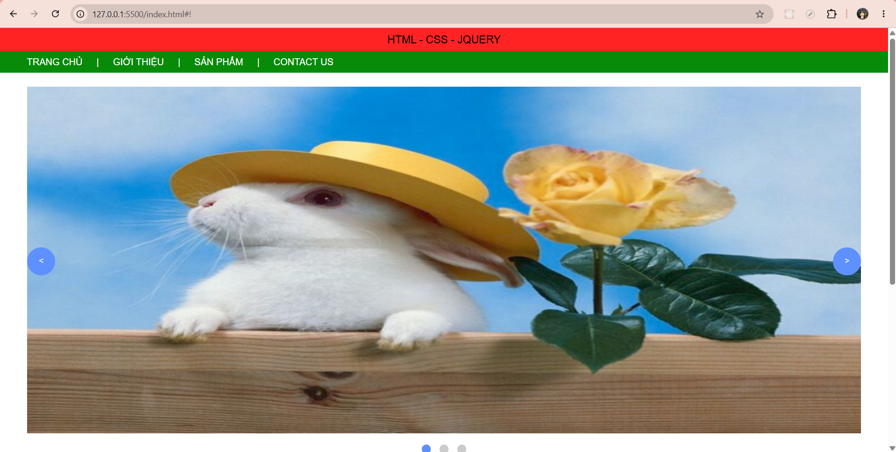
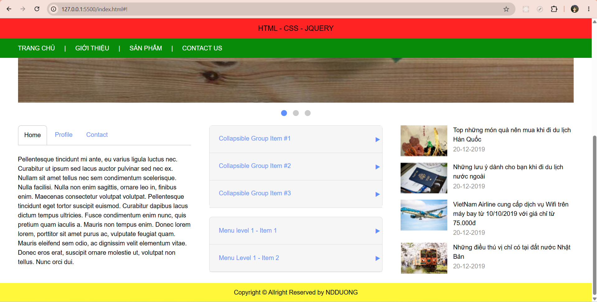

# FE (Check HTML, CSS, JS, Jquery, Responsive)

## Table of Contents

- [FE (Check HTML, CSS, JS, Jquery, Responsive)](#fe-check-html-css-js-jquery-responsive)
  - [Table of Contents](#table-of-contents)
  - [Features](#features)
  - [Goal](#goal)
  - [Fix bugs](#fix-bugs)
    - [2026-06-19](#2026-06-19)
    - [2026-06-22](#2026-06-22)
  - [UI Screenshots](#ui-screenshots)
  - [Time Tracking](#time-tracking)
  - [Future Work](#future-work)

## Features

- Exercise of HTML, CSS, JS, Jquery, Responsive
  - Slider Image:
    - images display flex, overflow-x hidden, then set width in list, marginLeft -100% per image, disabled when animate
    - dots: update dot according to target slide, this.index, disabled when animate.
  - Tab function:
    - active class in tab header & tab content
    - data tab
    - fadeIn, hide in tab content
    - check if current tab is active tab, if not then remove 2 active, hide content, add 2 active to active tab and fadeIn
  - Accordion function
    - active class in tab header & tab content
    - data tab
    - slideUp, slideDown in tab content
    - check if current tab is active tab, if not then remove 2 active, slideUp, add 2 active to active tab and slideDown
  - 3-levels menu
    - Repeating structure: menus is content of level 1, content is content of level 2,3... In 1 content: the items (tabs) to click -> this include header (clickable) and content of the next level
    - data menu
    - border in menus and border-bottom in header (not nth-of-type)
    - logic: click header not have menus -> close all menus, otherwise open menu
  - List of news
  - Responsive
    - Add mobile button, mobile menu, overlay
    - Click mobile button -> Show mobile menu & overlay
    - Click outside / link in mobile menu -> Hide mobile menu & overlay

## Goal

- Learning and using slider image, tab function, accordion, 3-levels menu in jquery

## Fix bugs

### 2026-06-19

- Wrong layout
- Header & Footer have the same color
- Wrong slide (2 half picture of 2 different images in 1 screen)
- Button must be at the center

### 2026-06-22

- Change folder structure
- Responsive: Mobile layout 1 column, tablet layout 2 columns
  - Images in news: text long --> 1 image height > others
  - Footer not in right place
  - Tablet need 2 news in 1 rows. Also large mobile (if has enough width then 2 news in 1 rows).
- Top header outside header
- Delete transform css(0) at multilevel menu jquery
- Refactor click mobile menu button
- Add more child menus in multilevel menus
- Add hover to show child menus for navigation header
- Add "." + before remove class name

## UI Screenshots

| Screen1                                      |     | Screen 2                                      |
| -------------------------------------------- | --- | --------------------------------------------- |
|  |     |  |

## Time Tracking

| Date       | Task                                           | Notes |
| ---------- | ---------------------------------------------- | ----- |
| 2026-06-16 | Setup exercise, create README, do slider image | .     |
| 2026-06-17 | Do slider image jquery (cont), tab, accordion  | .     |
| 2026-06-18 | Do multilevel menu, fix css & js logic         | .     |
| 2026-06-19 | Fix multilevel menu, do responsive, fix bugs   | .     |
| 2026-06-22 | Fix bugs                                       | .     |

## Future Work

- [ ] Update app structure, optimize and clean code.
- [ ] UI : Design the UI better, cleaner.
